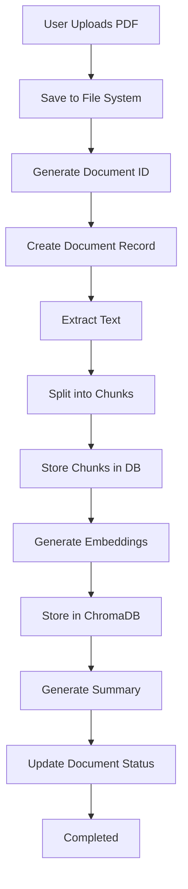
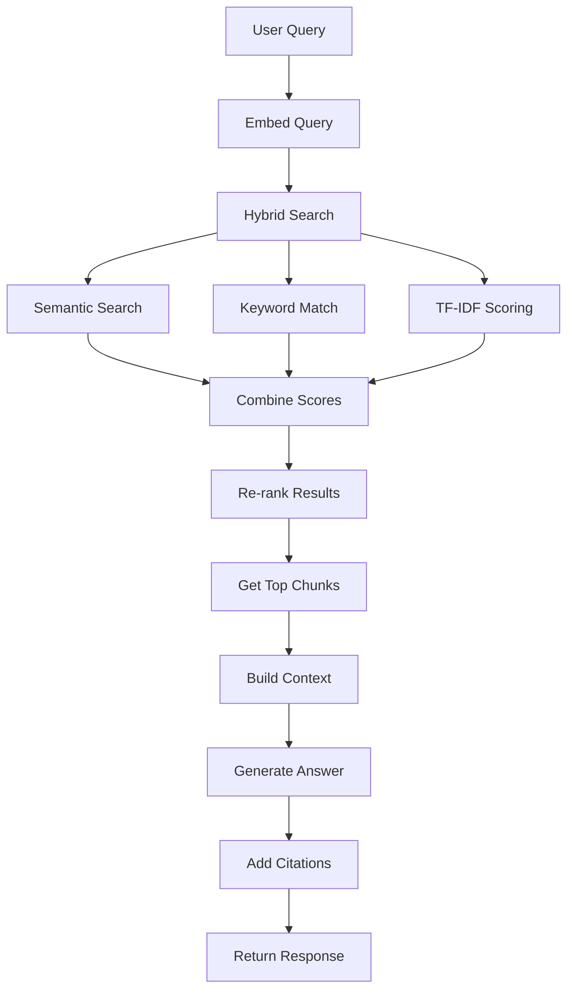

# Architecture and Data Flow

## Overview

This document explains how all the pieces of Atlas AI Assistant fit together. We'll walk through the architecture, how requests flow through the system, and how different components interact. Think of this as a map of how everything connects.

## High-Level Architecture

```
┌──────────────────────────────────────────────────────────────┐
│                      User's Browser                          │
│  ┌────────────────────────────────────────────────────────┐ │
│  │              React Frontend Application                │ │
│  │  ┌──────────┐  ┌──────────┐  ┌──────────┐            │ │
│  │  │  Pages   │  │Components│  │  API     │            │ │
│  │  │          │  │          │  │ Services │            │ │
│  │  └────┬─────┘  └────┬─────┘  └────┬─────┘            │ │
│  └───────┼──────────────┼────────────┼───────────────────┘ │
└──────────┼──────────────┼────────────┼──────────────────────┘
           │              │            │
           │ HTTP Requests│            │
           │ (REST API)   │            │
           │              │            │
           ▼              ▼            ▼
┌──────────────────────────────────────────────────────────────┐
│                    Django Backend                            │
│  ┌────────────────────────────────────────────────────────┐ │
│  │              Middleware Layer                           │ │
│  │  ┌──────────────────────────────────────────────────┐  │ │
│  │  │      ClerkJWTMiddleware                         │  │ │
│  │  │  (Extracts user ID from JWT token)               │  │ │
│  │  └────────────────────┬─────────────────────────────┘  │ │
│  └──────────────────────┼─────────────────────────────────┘ │
│  ┌──────────────────────▼─────────────────────────────────┐ │
│  │              Views (API Endpoints)                     │ │
│  │  - Document upload, list, delete                      │ │
│  │  - Chat conversations and messages                     │ │
│  │  - Search and query                                    │ │
│  └──────────────────────┬─────────────────────────────────┘ │
│  ┌──────────────────────▼─────────────────────────────────┐ │
│  │              Services Layer                            │ │
│  │  ┌──────────────┐  ┌──────────────┐  ┌──────────────┐ │ │
│  │  │ PDFService   │  │ Embedding    │  │ ChromaDB     │ │ │
│  │  │              │  │ Service      │  │ Service      │ │ │
│  │  └──────────────┘  └──────────────┘  └──────────────┘ │ │
│  │  ┌──────────────┐                                      │ │
│  │  │ OllamaService│  (AI for summaries & answers)       │ │
│  │  └──────────────┘                                      │ │
│  └──────────────────────┬─────────────────────────────────┘ │
└─────────────────────────┼───────────────────────────────────┘
                          │
        ┌─────────────────┼─────────────────┐
        │                 │                 │
        ▼                 ▼                 ▼
┌──────────────┐  ┌──────────────┐  ┌──────────────┐
│  PostgreSQL  │  │   ChromaDB   │  │  File System │
│  (SQLite)    │  │  (Vectors)    │  │   (PDFs)     │
└──────────────┘  └──────────────┘  └──────────────┘
```

## Request Flow: Document Upload

Let's trace what happens when a user uploads a PDF:

```
┌─────────────┐
│   User      │
│  Uploads    │
│    PDF      │
└──────┬──────┘
       │
       ▼
┌─────────────────────────────────────────────────┐
│  Frontend: UploadDialog Component               │
│  1. User selects file                           │
│  2. Validates file (type, size)                 │
│  3. Creates FormData                            │
│  4. Calls DocumentsService.uploadDocument()     │
└──────┬──────────────────────────────────────────┘
       │
       │ POST /api/docs/upload/
       │ Authorization: Bearer <token>
       │ Content-Type: multipart/form-data
       │
       ▼
┌─────────────────────────────────────────────────┐
│  Backend: ClerkJWTMiddleware                    │
│  1. Extracts JWT token from header              │
│  2. Verifies token with Clerk                   │
│  3. Extracts clerk_user_id                      │
│  4. Attaches to request object                  │
└──────┬──────────────────────────────────────────┘
       │
       ▼
┌─────────────────────────────────────────────────┐
│  Backend: upload_pdf view                       │
│  1. Validates file (PDF, size limits)           │
│  2. Creates user directory: pdfs/{user_id}/    │
│  3. Saves file to disk                          │
│  4. Generates document_id (MD5 hash)            │
│  5. Checks for duplicates                       │
│  6. Creates Document record (status: pending)   │
│  7. Returns response immediately                │
└──────┬──────────────────────────────────────────┘
       │
       │ (Background thread starts)
       ▼
┌─────────────────────────────────────────────────┐
│  Background Processing                          │
│  1. PDFService.extract_text_from_pdf()          │
│     → Extracts all text from PDF                │
│  2. EmbeddingService.split_text_into_chunks()   │
│     → Splits into 1000-char chunks (200 overlap)│
│  3. Update status: "processing"                │
│  4. For each chunk:                            │
│     a. Create DocumentChunk in database        │
│     b. ChromaDBService.add_document_chunks()    │
│        → Generates embedding, stores in ChromaDB│
│  5. OllamaService.generate_summary()            │
│     → Creates document summary                 │
│  6. Update Document:                           │
│     - summary: AI-generated text                │
│     - processing_status: "completed"           │
└─────────────────────────────────────────────────┘
```

## Request Flow: Chat Message

When a user sends a chat message:

```
┌─────────────┐
│   User      │
│  Types      │
│  Message    │
└──────┬──────┘
       │
       ▼
┌─────────────────────────────────────────────────┐
│  Frontend: ChatPage Component                   │
│  1. User types message                          │
│  2. Calls ChatService.postMessage()            │
│  3. Shows loading state                         │
└──────┬──────────────────────────────────────────┘
       │
       │ POST /api/chat/conversations/{id}/message/
       │ Body: { content: "...", user_documents_only: true }
       │
       ▼
┌─────────────────────────────────────────────────┐
│  Backend: post_chat_message view                │
│  1. Gets or creates conversation                 │
│  2. Saves user message to database              │
│  3. Determines document scope:                  │
│     - If user_documents_only: filter by user_id │
│     - If document_ids provided: use those      │
│  4. Calls ChromaDBService.hybrid_search()     │
└──────┬──────────────────────────────────────────┘
       │
       ▼
┌─────────────────────────────────────────────────┐
│  ChromaDBService.hybrid_search()                │
│  1. Embeds query (converts to vector)          │
│  2. Semantic search (vector similarity)        │
│     → Gets top 50 candidates                    │
│  3. Keyword overlap scoring                     │
│     → Token-based matching                      │
│  4. TF-IDF scoring                              │
│     → Term frequency analysis                   │
│  5. Score normalization                         │
│     → All scores to [0, 1] range               │
│  6. Re-ranking                                   │
│     → Group by semantic score, sort by keyword │
│  7. Deduplication                               │
│     → One result per document                   │
│  8. Returns top N chunks with scores            │
└──────┬──────────────────────────────────────────┘
       │
       ▼
┌─────────────────────────────────────────────────┐
│  OllamaService.search_and_answer()               │
│  1. Builds context from retrieved chunks        │
│  2. Creates prompt:                              │
│     - User question                              │
│     - Relevant document chunks                  │
│     - Instructions for citations                │
│  3. Calls Ollama API                            │
│  4. Extracts answer from response               │
└──────┬──────────────────────────────────────────┘
       │
       ▼
┌─────────────────────────────────────────────────┐
│  Backend: post_chat_message (continued)        │
│  1. PDFService.find_text_pages()                │
│     → Finds page numbers for citations          │
│  2. Formats citations with metadata             │
│  3. Saves assistant message to database:         │
│     - content: AI answer                        │
│     - citations: source references              │
│     - document_ids: used documents              │
│  4. Updates conversation title (if empty)       │
│  5. Returns response                            │
└──────┬──────────────────────────────────────────┘
       │
       │ Response: { answer: "...", sources: [...] }
       │
       ▼
┌─────────────────────────────────────────────────┐
│  Frontend: ChatPage Component                   │
│  1. Receives response                           │
│  2. Displays answer with citations              │
│  3. Updates message list                        │
│  4. Scrolls to bottom                           │
└─────────────────────────────────────────────────┘
```

## Component Interactions

### Frontend Components

**LandingPage.tsx**
- Marketing/landing page
- Shows features and benefits
- Sign-up/sign-in buttons

**ChatPage.tsx**
- Main chat interface
- Message list
- Input area
- Citation display
- Uses ChatService for API calls

**DocumentsPreviewPage.tsx**
- Lists user's documents
- Upload dialog
- Status indicators
- Delete functionality
- Uses DocumentsService

**StudyMaterialsPage.tsx**
- Generates quizzes, flashcards, notes
- Interactive study tools
- Uses DocumentsService for generation

### Backend Services

**PDFService**
- `extract_text_from_pdf()` - Gets text from PDF
- `get_file_hash()` - Generates MD5 hash
- `get_document_info()` - Extracts metadata
- `find_text_pages()` - Finds page numbers for text

**EmbeddingService**
- `split_text_into_chunks()` - Splits text intelligently
- `create_chunk_embedding_id()` - Generates unique IDs
- Handles sentence boundaries and overlap

**ChromaDBService**
- `add_document_chunks()` - Stores embeddings
- `hybrid_search()` - Multi-strategy search
- `delete_document_chunks()` - Removes embeddings
- `get_collection_stats()` - Collection info

**OllamaService**
- `generate_summary()` - Creates document summaries
- `answer_question()` - Answers based on context
- `search_and_answer()` - Full Q&A with citations
- Handles API communication

## Data Flow Diagrams

### Document Processing Pipeline



### RAG Query Flow



## Authentication Flow

```
┌─────────────┐
│   User      │
│  Signs In   │
│  (Clerk)    │
└──────┬──────┘
       │
       ▼
┌─────────────────────────────────────────────────┐
│  Clerk Authentication                           │
│  1. User authenticates                          │
│  2. Clerk issues JWT token                      │
│  3. Token includes user ID (sub claim)         │
└──────┬──────────────────────────────────────────┘
       │
       │ Token stored in frontend
       │
       ▼
┌─────────────────────────────────────────────────┐
│  Frontend API Calls                              │
│  - Adds token to Authorization header            │
│  - Format: "Bearer <token>"                     │
└──────┬──────────────────────────────────────────┘
       │
       │ HTTP Request with token
       │
       ▼
┌─────────────────────────────────────────────────┐
│  Backend: ClerkJWTMiddleware                    │
│  1. Extracts token from header                  │
│  2. Verifies token signature                    │
│  3. Decodes token payload                       │
│  4. Extracts clerk_user_id (sub)               │
│  5. Attaches to request.clerk_user_id           │
└──────┬──────────────────────────────────────────┘
       │
       ▼
┌─────────────────────────────────────────────────┐
│  View Function                                   │
│  - Accesses request.clerk_user_id                │
│  - Filters data by user                         │
│  - Ensures user isolation                       │
└─────────────────────────────────────────────────┘
```

## Error Handling Flow

```
┌─────────────────────────────────────────────────┐
│  Error Occurs                                    │
└──────┬──────────────────────────────────────────┘
       │
       ▼
┌─────────────────────────────────────────────────┐
│  Try/Except Block                               │
│  - Catches exception                            │
│  - Logs error details                           │
└──────┬──────────────────────────────────────────┘
       │
       ▼
┌─────────────────────────────────────────────────┐
│  Error Response                                  │
│  - Status code (400, 401, 500, etc.)           │
│  - Error message                                │
│  - Details (if available)                       │
└──────┬──────────────────────────────────────────┘
       │
       ▼
┌─────────────────────────────────────────────────┐
│  Frontend Error Handling                        │
│  - Catches ApiError                             │
│  - Displays user-friendly message               │
│  - Shows toast notification                     │
└─────────────────────────────────────────────────┘
```

## Service Layer Architecture

### How Services Interact

```
Views (API Endpoints)
    │
    ├──→ PDFService
    │     └──→ File System
    │
    ├──→ EmbeddingService
    │     └──→ Text Processing
    │
    ├──→ ChromaDBService
    │     ├──→ EmbeddingService (for chunk IDs)
    │     └──→ ChromaDB
    │
    └──→ OllamaService
          ├──→ ChromaDBService (for context)
          └──→ PDFService (for page numbers)
```

### Service Responsibilities

**PDFService**
- File operations
- Text extraction
- Metadata extraction
- Page number finding

**EmbeddingService**
- Text chunking
- ID generation
- Text normalization

**ChromaDBService**
- Vector storage
- Semantic search
- Hybrid search algorithm
- Collection management

**OllamaService**
- AI API communication
- Prompt engineering
- Response parsing
- Error handling

## State Management

### Frontend State

**React State:**
- Component-level state (useState)
- Form inputs
- UI state (loading, errors)

**TanStack Query:**
- Server state caching
- Automatic refetching
- Loading/error states
- Optimistic updates

**Clerk:**
- Authentication state
- User information
- Session management

### Backend State

**Database:**
- Persistent data
- User documents
- Conversations
- Messages

**ChromaDB:**
- Vector embeddings
- Search index

**File System:**
- PDF files
- User directories

## Concurrency and Async Processing

### Document Processing

Documents are processed asynchronously:

```
1. Upload request returns immediately
2. Background thread starts processing
3. Status updates in database
4. Frontend polls for status updates
5. User sees real-time progress
```

**Why Async?**
- Large PDFs take time to process
- Don't want to block the request
- Better user experience

### Concurrent Requests

Django handles multiple requests concurrently:
- Each request is independent
- Database connections are pooled
- ChromaDB is thread-safe
- No shared mutable state

## Performance Optimizations

### Frontend
- Code splitting (Vite)
- Lazy loading components
- React Query caching
- Optimistic updates

### Backend
- Database query optimization
- Batch processing (ChromaDB)
- Connection pooling
- Async processing

### Search
- Hybrid search combines multiple signals
- Re-ranking improves relevance
- Deduplication reduces noise
- Caching frequent queries

## Summary

**Key Flows:**
1. **Upload**: File → Database → Process → ChromaDB → Summary
2. **Chat**: Query → Search → AI → Citations → Response
3. **Auth**: Token → Middleware → User ID → Filtering

**Key Principles:**
- Separation of concerns (services)
- User isolation at every level
- Async processing for long operations
- Error handling throughout
- Type safety (TypeScript + Python types)

**Architecture Benefits:**
- Maintainable (clear separation)
- Scalable (can add more services)
- Testable (services are isolated)
- Secure (user isolation)

Everything is designed to work together seamlessly while remaining independent enough to modify individual pieces without breaking the whole system!
